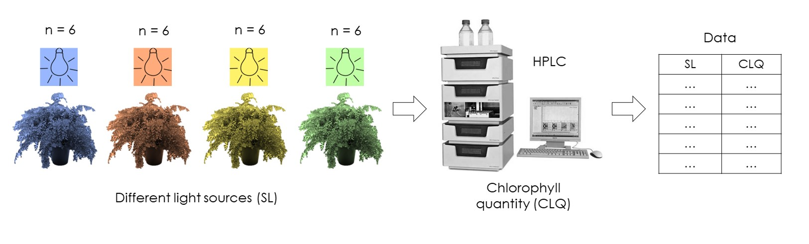

R in the Lab: More than Two Treatments Comparison
================

## 1 Problem

You want to investigate the effect of light on plant growth. For this
you designed an experiment that includes four different light sources.
For each source you placed six plants (you replicate each treatment six
times) in chambers with a specific light bulb. You kept the plants in
their chambers for a fixed time and then you quantified the
<a href="https://en.wikipedia.org/wiki/Chlorophyll" target="_blank">chlorophyll</a>
of each plant.



At the end your experimental data may look like this:

<table class=" lightable-classic-2" style='font-family: "Arial Narrow", "Source Sans Pro", sans-serif; width: auto !important; margin-left: auto; margin-right: auto;'>

<thead>

<tr>

<th style="text-align:left;">

SL

</th>

<th style="text-align:right;">

CLQ

</th>

</tr>

</thead>

<tbody>

<tr>

<td style="text-align:left;">

SL1

</td>

<td style="text-align:right;">

21.0

</td>

</tr>

<tr>

<td style="text-align:left;">

SL1

</td>

<td style="text-align:right;">

27.7

</td>

</tr>

<tr>

<td style="text-align:left;">

SL1

</td>

<td style="text-align:right;">

19.7

</td>

</tr>

<tr>

<td style="text-align:left;">

SL1

</td>

<td style="text-align:right;">

23.7

</td>

</tr>

<tr>

<td style="text-align:left;">

SL1

</td>

<td style="text-align:right;">

28.6

</td>

</tr>

<tr>

<td style="text-align:left;">

SL1

</td>

<td style="text-align:right;">

21.7

</td>

</tr>

<tr>

<td style="text-align:left;">

SL2

</td>

<td style="text-align:right;">

34.3

</td>

</tr>

<tr>

<td style="text-align:left;">

SL2

</td>

<td style="text-align:right;">

33.8

</td>

</tr>

<tr>

<td style="text-align:left;">

SL2

</td>

<td style="text-align:right;">

34.8

</td>

</tr>

<tr>

<td style="text-align:left;">

SL2

</td>

<td style="text-align:right;">

36.1

</td>

</tr>

</tbody>

</table>

I’m only showing you the first ten data points, but remember that in
total we have 24 chlorophyll measurements.

The next step is to make a summary table with means and standard
deviations, some plots and of course perform and inferential statistic
analysis to establish significant differences between light source
treatments.

## 2 Solution

First, as always, I must show you my file organization:


  - The analysis folder contains all my R scripts.  
  - The data folder contains the experimental data and all CSV and TXT
    files products of my analysis scripts.  
  - The graph folder contains all the plot results of my analysis
    scripts.

These three folders are contained in a main folder with a representative
name.

### 2.1 Data Summary

For make a summary table with means and standard deviations I used the
following R script:

``` r
# Data summary ------------------------------------------------------------

if(!"dplyr" %in% .packages()) library(dplyr)

# 1 Import data -----------------------------------------------------------
main_data <- read.csv("data/main_data.csv")

# 2 Data summary ---------------------------------------------------------
sum_data <- main_data %>% 
  group_by(SL) %>% 
  summarise(
    MEAN = mean(CLQ),
    SD   = sd(CLQ),
    CV   = SD * 100 / MEAN
  )

# 3 Save summary ---------------------------------------------------------
write.csv(sum_data, file = "data/summary_data.csv", row.names = FALSE)
```

I followed the usual steps that I used in all my analysis: import data
\> make analysis \> export results. The line of code `if(!"dplyr" %in%
.packages()) library(dplyr)` checks if the necessary packages are
already loaded, you can omit the if statement while working on your own.

As can you see in the second step, it is very easy to make this kind of
tables using the `dplyr` package:

``` r
# 2 Data summary ---------------------------------------------------------
sum_data <- main_data %>% 
  group_by(SL) %>% 
  summarise(
    MEAN = mean(CLQ),
    SD   = sd(CLQ),
    CV   = SD * 100 / MEAN
  )
```

With `group_by()` I specified to perform the next operations, using
`summarise()`, grouping the data by light source treatment, so this way
I obtained four means, four standard deviations and four
<a href="https://en.wikipedia.org/wiki/Coefficient_of_variation" target="_blank">coefficients
of variance</a>.

You can see the results in the data folder or by typing `sum_data`:

``` r
sum_data
```

<table class=" lightable-classic-2" style='font-family: "Arial Narrow", "Source Sans Pro", sans-serif; width: auto !important; margin-left: auto; margin-right: auto;'>

<thead>

<tr>

<th style="text-align:left;">

SL

</th>

<th style="text-align:right;">

MEAN

</th>

<th style="text-align:right;">

SD

</th>

<th style="text-align:right;">

CV

</th>

</tr>

</thead>

<tbody>

<tr>

<td style="text-align:left;">

SL1

</td>

<td style="text-align:right;">

23.73

</td>

<td style="text-align:right;">

3.67

</td>

<td style="text-align:right;">

15.46

</td>

</tr>

<tr>

<td style="text-align:left;">

SL2

</td>

<td style="text-align:right;">

35.28

</td>

<td style="text-align:right;">

2.23

</td>

<td style="text-align:right;">

6.33

</td>

</tr>

<tr>

<td style="text-align:left;">

SL3

</td>

<td style="text-align:right;">

21.38

</td>

<td style="text-align:right;">

2.31

</td>

<td style="text-align:right;">

10.79

</td>

</tr>

<tr>

<td style="text-align:left;">

SL4

</td>

<td style="text-align:right;">

18.88

</td>

<td style="text-align:right;">

1.81

</td>

<td style="text-align:right;">

9.60

</td>

</tr>

</tbody>

</table>

### 2.2 One-Way Analysis of Variance Analysis

Now it is time to establish if there are significant differences between
treatments. For this I performed an
<a href ="https://ccforum.biomedcentral.com/articles/10.1186/cc2836" target="_blank">one-way
analysis of variance</a>.

I used the following R script:

``` r
# Analysis of Variance ----------------------------------------------------

# 1 Import data -----------------------------------------------------------
main_data <- read.csv("data/main_data.csv")

# 2 AOV analysis ----------------------------------------------------------

# 2.1 Fit AOV model
data_aov <- aov(CLQ ~ SL, data = main_data)

# 2.2 ANOVA table 
anova_table <- anova(data_aov)

# 3 Save results ----------------------------------------------------------
write.csv(
  anova_table, file = "data/ANOVA_table.csv", 
  row.names = FALSE, na = ""
  )
```

The code `aov(CLQ ~ SL, data = main_data)` fits an analysis of variance
model using the experimental data and the relation pointed by `CLQ ~
SL`.

To make the classic ANOVA table you need the function `anova()`. I made
this with the code `anova_table <- anova(data_aov)` and finally exported
it using the function `write.csv()`.  
You can see the result typing or looking in the data folder.

``` r
anova_table
```

<table class=" lightable-classic-2" style='font-family: "Arial Narrow", "Source Sans Pro", sans-serif; width: auto !important; margin-left: auto; margin-right: auto;'>

<thead>

<tr>

<th style="text-align:left;">

</th>

<th style="text-align:right;">

Df

</th>

<th style="text-align:right;">

Sum Sq

</th>

<th style="text-align:right;">

Mean Sq

</th>

<th style="text-align:right;">

F value

</th>

<th style="text-align:right;">

Pr(\>F)

</th>

</tr>

</thead>

<tbody>

<tr>

<td style="text-align:left;">

SL

</td>

<td style="text-align:right;">

3

</td>

<td style="text-align:right;">

946.3

</td>

<td style="text-align:right;">

315.4

</td>

<td style="text-align:right;">

46.6

</td>

<td style="text-align:right;">

0

</td>

</tr>

<tr>

<td style="text-align:left;">

Residuals

</td>

<td style="text-align:right;">

20

</td>

<td style="text-align:right;">

135.3

</td>

<td style="text-align:right;">

6.8

</td>

<td style="text-align:right;">

</td>

<td style="text-align:right;">

</td>

</tr>

</tbody>

</table>

At this case the *p-value* (in the `Pr(>F)` column) is so small that is
rounded to zero.

So, now that you’ve established that there are significant differences,
which treatment means are different? The ANOVA table doesn’t give any
information about this question.

### 2.3 Multiple Mean Comparisons (Tukey HSD test)

To establish differences between treatments I performed a
<a href= "https://sciencing.com/what-is-the-tukey-hsd-test-12751748.html" target="_blank">Tukey
HSD test</a>.

I used the next R script:

``` r
# Multiple comparisons: Tukey --------------------------------------------

if(!"agricolae" %in% .packages()) library(agricolae)

# 1 Import data -----------------------------------------------------------
main_data <- read.csv(file = "data/main_data.csv")

# 2 HSD test --------------------------------------------------------------

# 2.1 Fit AOV model
data_aov <- aov(CLQ ~ SL, data = main_data)

# 2.2 HSD test on aov model
hsd_test <- HSD.test(data_aov, trt = "SL")

# 3 Save results

# 3.1 Groups from hsd_test
hsd_groups <- data.frame(
  SL = row.names(hsd_test$groups), 
  groups = hsd_test$groups[,2]
  )

# 3.2 Save as a data frame
write.csv(hsd_groups, file = "data/hsd_groups.csv", row.names = FALSE)
```

The package `agricolae` contains the useful function `HSD.test()`. You
can see the result of this test by typing `hsd_test`:

``` r
hsd_test
```

    ## $statistics
    ##    MSerror Df     Mean       CV     MSD
    ##   6.763917 20 24.82083 10.47811 4.20273
    ## 
    ## $parameters
    ##    test name.t ntr StudentizedRange alpha
    ##   Tukey     SL   4         3.958293  0.05
    ## 
    ## $means
    ##          CLQ      std r  Min  Max    Q25   Q50    Q75
    ## SL1 23.73333 3.668606 6 19.7 28.6 21.175 22.70 26.700
    ## SL2 35.28333 2.233756 6 33.3 39.4 33.925 34.55 35.775
    ## SL3 21.38333 2.306874 6 17.4 23.6 20.800 21.50 23.175
    ## SL4 18.88333 1.812641 6 16.1 21.3 17.950 19.30 19.675
    ## 
    ## $comparison
    ## NULL
    ## 
    ## $groups
    ##          CLQ groups
    ## SL2 35.28333      a
    ## SL1 23.73333      b
    ## SL3 21.38333     bc
    ## SL4 18.88333      c
    ## 
    ## attr(,"class")
    ## [1] "group"

The test is performed using an alpha = 0.05 (you can change this within
the function). There are other results that maybe could be useful, but
at this case I just save the information related to the groups:

``` r
# 3 Save results

# 3.1 Groups from hsd_test
hsd_groups <- data.frame(
  SL = row.names(hsd_test$groups), 
  groups = hsd_test$groups[,2]
  )

# 3.2 Save as a data frame
write.csv(hsd_groups, file = "data/hsd_groups.csv", row.names = FALSE)
```

The `hsd_table` contains information about the groups treatments. In
this column a different letter indicates a significant difference
between treatment means at the specified alpha.

``` r
hsd_groups
```

<table class=" lightable-classic-2" style='font-family: "Arial Narrow", "Source Sans Pro", sans-serif; width: auto !important; margin-left: auto; margin-right: auto;'>

<thead>

<tr>

<th style="text-align:left;">

SL

</th>

<th style="text-align:left;">

groups

</th>

</tr>

</thead>

<tbody>

<tr>

<td style="text-align:left;">

SL2

</td>

<td style="text-align:left;">

a

</td>

</tr>

<tr>

<td style="text-align:left;">

SL1

</td>

<td style="text-align:left;">

b

</td>

</tr>

<tr>

<td style="text-align:left;">

SL3

</td>

<td style="text-align:left;">

bc

</td>

</tr>

<tr>

<td style="text-align:left;">

SL4

</td>

<td style="text-align:left;">

c

</td>

</tr>

</tbody>

</table>

Following alphabetical order the letter “a” indicates that SL2 mean is
greater than SL1, SL3 and SL4 mean treatments. The interpretation of the
remain letters can be made the same way. The combination “bc” in the
treatment SL3 indicates that its mean cannot be considered different
from SL1 and SL4 means. That’s weird\! Remember that we are talking
about statistical differences, so you can expect this kind of results in
many of your experiments (trust me).

### 2.4 Plots

Finally, the plots time. For this kind of experiments it is quite common
to represent the treatments means as bars with their standard deviations
as intervals. Anyway, I present another alternatives to represent the
data that could be useful.

#### 2.4.1 Bar Plot

To make the bar chart I used the next R script:

``` r
# Means bar plot   --------------------------------------------------------

if(!"ggplot2" %in% .packages()) library(ggplot2)

# Global theme
source("analysis/theme.R")

# 1 Import data ----------------------------------------------------------

# 1.1 Summary data
sum_data <- read.csv("data/summary_data.csv")

# 1.2 HSD groups
groups <- read.csv("data/hsd_groups.csv")

# 1.3 Join summary and groups data frames
sum_data <- merge(sum_data, groups, by = "SL")

# 2 Bar chart
bar_plot <- ggplot(sum_data, aes(x = SL, y = MEAN, label = groups)) +
  geom_col(width = 0.5, color = "black", fill = "royalblue1") +
  geom_errorbar(aes(ymin = MEAN - SD, ymax = MEAN + SD), width = 0.1) +
  geom_text(nudge_y = 5, size = 5) +
  xlab("Light source type") +
  ylab("Chlorophyll (mg/g)")

# 3 Save plot
ggsave(filename = "graphs/bar_plot.jpeg", bar_plot)
```

I just used the summary table made it in the previous section. I joined
the groups information to the summary using the function `merge()`:
`sum_data <- merge(sum_data, groups, by = "SL")`.

You can notice that I employed the `ggplot2` package and their
functions. `geom_col()` is in charge of representing the means as bars,
while `geom_errorbar()` represents the standard deviations as intervals.
`geom_text()` uses the groups information and places it above each bar.

The code `source("analysis/theme.R")` runs the next script, that sets a
global theme used in all my graphs:

``` r
# Set theme for all graphs ------------------------------------------------

theme_set(
  theme_classic() +
    theme(axis.text.x = element_text(color = "black", size = 13),
          axis.text.y = element_text(color = "black", size = 13),
          axis.title = element_text(color = "black", size = 15))
)
```

The bar chart can be seen typing `bar_plot` and is saved in the graphs
folder.

``` r
bar_plot
```

<!-- -->

#### 2.4.2 Point Plot

With a point graph we can represent each measurement as a point.

``` r
# Point plot  -------------------------------------------------------------

if (!"ggplot2" %in% .packages()) library(ggplot2)

# Global theme
source("analysis/theme.R")

# 1 Import data -------------------------------------------------------------

# 1.1 Experimental data
main_data <- read.csv("data/main_data.csv")

# 1.2 Summary data
sum_data <- read.csv("data/summary_data.csv")

# 1.3 HSD groups
groups <- read.csv("data/hsd_groups.csv")

# 1.4 Join groups and summary
groups <- merge(groups, sum_data, by = "SL")

# 2 Point plot  -------------------------------------------------------------
point_plot <- ggplot(main_data, aes(x = SL, y = CLQ)) +
  geom_point() +
  stat_summary(fun = mean, geom = "crossbar", width = 0.2, col = "blue") +
  geom_text(data = groups, 
            aes(x = SL, y = MEAN, label = groups), nudge_x = 0.2, 
            size = 5) + 
  xlab("Light source type") +
  ylab("Chlorophyll (mg/g)")


# 3 Save plot -------------------------------------------------------------
ggsave(filename = "graphs/point_plot.jpeg", point_plot)
```

I made this plot in a similar way than the bar chart. I used the
`ggplot2` functions `geom_point()` to represent each measurement as a
point, `stat_summary()` to add a blue bar representing each treatment
mean, and `geom_text()` to put the letter group a little to the right of
each mean bar. The plot looks like this:

``` r
point_plot
```

<!-- -->

#### 2.4.3 Bar and Points Plot

Using `ggplot2` you can even combine the both previous plots:

``` r
# Bar with points plot ----------------------------------------------------

if (!"ggplot2" %in% .packages()) library(ggplot2)

# Global theme
source("analysis/theme.R")

# 1 Import data -------------------------------------------------------------

# 1.1 Experimental data
main_data <- read.csv("data/main_data.csv")

# 1.2 Summary data
sum_data <- read.csv("data/summary_data.csv")

# 1.3 HSD groups
groups <- read.csv("data/hsd_groups.csv")

# 1.4 Join groups and summary
sum_data <- merge(groups, sum_data, by = "SL")


# 2 Bar point plot --------------------------------------------------------
bar_point_plot <- ggplot(sum_data, aes(x = SL, y = MEAN)) +
  geom_col(
    width = 0.5, color = "black", fill = "royalblue1"
    ) +
  geom_errorbar(
    aes(ymin = MEAN - SD, ymax = MEAN + SD),  width = 0.1
    ) +
  geom_text(
    aes(label = groups), nudge_y = 6.5, size = 5
    ) +
  geom_point(
    data = main_data, aes(x = SL, y = CLQ), color = "red", size = 1.5
    ) +
  xlab("Light source type") +
  ylab("Chlorophyll (mg/g)")

# 3 Save plot ---------------------------------------------------------------
ggsave(filename = "graphs/bar_point_plot.jpeg", bar_point_plot)
```

This code produces the next plot:

``` r
bar_point_plot
```

<!-- -->

Wow\! That’s it\! If you wish, you are free to clone the repository with
the code and results of this R tutorial, including the experimental data
simulation:

<a href="https://github.com/jpch26/More-than-Two-Treatments-Comparison" target="_blank">More
than Two Treatments Comparison</a>

Try to reproduce the analysis step by step, modify or improve the code.
It’s all yours\!
